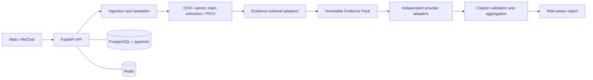

# Architecture

## Implemented boundary

The repository implements the foundation plus secure text/screenshot
ingestion, bounded local OCR, PII masking, atomic claim extraction, grounded
PICO framing, normalization completeness auditing, and Phase 4A PubMed-only
retrieval. It does not invoke judges or make a medical judgment.

For screenshot input, the API accepts only decoded PNG/JPEG/WebP images under
server-set byte/pixel limits, rejects animation, and stores a metadata-stripped
PNG under an opaque key. Raw image bytes remain outside PostgreSQL. At most 24
hours later, request-time and lifespan cleanup remove raw upload objects and
the associated short-lived analysis record.

## Target system



## Repository layout

```text
backend/                 FastAPI application, schema, tests, migrations
frontend/                React + TypeScript + Vite + Tailwind application
wechat-mini-program/     Native Mini Program screen placeholders
evaluation/               Benchmark fixtures and experiment records
infrastructure/           Deployment-oriented configuration and notes
scripts/                  Developer automation
docs/                     API, data, architecture, decisions, and roadmap
```

## Service boundaries

`backend/app/adapters/` is reserved for all outbound systems: PubMed/NCBI,
WHO/CDC curated sources, Crossref, OCR, object storage, Redis-backed rate
limits, and every model provider. Endpoint code must depend on an adapter
interface, never an SDK call scattered through routes or pipeline stages.

Phase 2 adapters are concrete but replaceable: `TesseractOcrAdapter` starts a
bounded local process with no shell interpolation, `LocalFilesystemUploadStorage`
stores only sanitized images for development/container use, and
`OpenAICompatibleClaimExtractor` calls a configured structured-output endpoint.
`MiriClaimExtractor` calls the gateway documented in `../ai api.md` using
`chatgpt-auto` by default. The gateway drives browser UIs and does not promise
strict JSON schema enforcement, so the adapter parses its text response as JSON
and the backend validates every source span locally.
The extractor receives redacted text between untrusted-data delimiters. Its
candidate spans are checked locally against the exact redacted source before
persistence. When no approved extractor is configured, the API fails closed.
The current model-produced PICO slots may be null and must be treated as query
framing candidates until entity and evidence validation are implemented. The
gateway's ChatGPT model picker is best-effort, so its requested mode is logged
without claiming an exact underlying model version.

Phase 3A checks every PICO value against its own redacted atomic claim before
storing it. Phase 3B adds a local read-only index generated from official NLM
MeSH descriptor XML. The index contains preferred labels, entry terms, tree
numbers, source hash, and production year; it is installed at runtime rather
than committed. Exact preferred and entry-term matches can resolve a MeSH ID.
Ambiguity and fuzzy/low-confidence suggestions remain unassigned. UMLS is a
separate optional provider, and no CUI is invented without licensed data.
Stored entity JSONB carries the terminology provenance; no schema migration is
needed. A batch command re-normalizes untouched pending claims only, with a
dry-run default. Future retrieval must distinguish coded concepts from
unresolved suggestions and never treat terminology matches as evidence.

Phase 3C restricts new claim types to a controlled taxonomy and locks explicit
English causal/association wording to its source meaning. A deterministic
quality check compares strong source MeSH phrases with grounded PICO/entity
mentions and checks type-specific required slots. Missing concepts become
`partial`, not `normalized`; the JSONB quality record explains why. Legacy
`normalized` rows become `partial` until re-audited. The extractor makes at
most one retry for malformed output or transient provider failures, without
weakening response validation or passing an invalid answer back to the model.

Phase 4A has a separate `app/retrieval/` pipeline: a deterministic QueryPlan
produces bounded MeSH, lexical, relation, and optional numeric queries; an
`app/adapters/pubmed.py` adapter uses official ESearch/EFetch; normalization
retains PubMed metadata and exact title/abstract sections; deduplication merges
query provenance; a deterministic lexical ranker assigns relevance-only scores;
and a frozen Evidence Pack assigns E1/E2/... identifiers and a SHA-256 over
canonical content excluding retrieval timestamps. The database stores an
append-only retrieval run, query rows, document-query links, versioned document
content, ranked passage metadata in the pack snapshot, and the complete frozen
JSON snapshot. Public PubMed documents may be reused across runs, while each
pack remains a separate audit object until the associated short-lived claim
is purged under the existing retention policy. Redis caches ESearch PMID lists for six
hours by source, query, and implementation version; failures bypass cache.
No full-text fetching, retraction claim, study-quality score, or verdict is
produced here.

PostgreSQL is the system of record. Redis is transient cache/rate-limit state
and must not be the sole copy of evidence or an analysis result. Evidence
passage vectors use pgvector, avoiding a separate vector database in the MVP.

## Safety and trust boundary

Raw user content and retrieved documents are untrusted. Future stages must
separate them from prompts/instructions, validate uploads and URLs, redact PII
before model calls, check retractions and identifiers in retrieval, and force
high-risk cases through stricter abstention thresholds.
