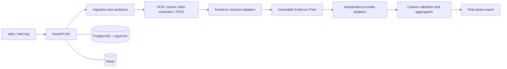

# Architecture

## Implemented boundary

The repository implements the foundation plus secure text/screenshot
ingestion, bounded local OCR, PII masking, and atomic claim extraction. It
does not retrieve evidence, invoke judges, or make a medical judgment.

For screenshot input, the API accepts only decoded PNG/JPEG/WebP images under
server-set byte/pixel limits, rejects animation, and stores a metadata-stripped
PNG under an opaque key. Raw image bytes remain outside PostgreSQL. At most 24
hours later, request-time and lifespan cleanup remove raw upload objects and
the associated short-lived analysis record.

## Target system



## Repository layout

```text
backend/                 FastAPI application, schema, tests, migrations
frontend/                React + TypeScript + Vite + Tailwind application
wechat-mini-program/     Native Mini Program screen placeholders
evaluation/               Benchmark fixtures and experiment records
infrastructure/           Deployment-oriented configuration and notes
scripts/                  Developer automation
docs/                     API, data, architecture, decisions, and roadmap
```

## Service boundaries

`backend/app/adapters/` is reserved for all outbound systems: PubMed/NCBI,
WHO/CDC curated sources, Crossref, OCR, object storage, Redis-backed rate
limits, and every model provider. Endpoint code must depend on an adapter
interface, never an SDK call scattered through routes or pipeline stages.

Phase 2 adapters are concrete but replaceable: `TesseractOcrAdapter` starts a
bounded local process with no shell interpolation, `LocalFilesystemUploadStorage`
stores only sanitized images for development/container use, and
`OpenAICompatibleClaimExtractor` calls a configured structured-output endpoint.
The extractor receives redacted text between untrusted-data delimiters. Its
candidate spans are checked locally against the exact redacted source before
persistence. When no approved extractor is configured, the API fails closed.

PostgreSQL is the system of record. Redis is transient cache/rate-limit state
and must not be the sole copy of evidence or an analysis result. Evidence
passage vectors use pgvector, avoiding a separate vector database in the MVP.

## Safety and trust boundary

Raw user content and retrieved documents are untrusted. Future stages must
separate them from prompts/instructions, validate uploads and URLs, redact PII
before model calls, check retractions and identifiers in retrieval, and force
high-risk cases through stricter abstention thresholds.
