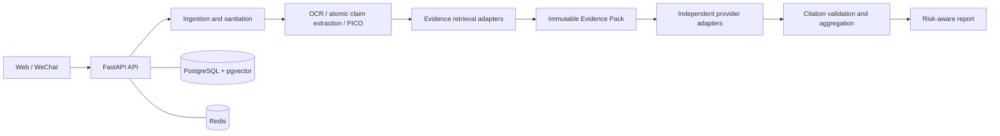

# Architecture

## Phase 1 boundary

The current repository creates the interfaces and storage foundation for the
verification system. Its analysis endpoints intentionally return mock
processing objects; they do not invoke AI systems or make medical judgments.

## Target system



## Repository layout

```text
backend/                 FastAPI application, schema, tests, migrations
frontend/                React + TypeScript + Vite + Tailwind application
wechat-mini-program/     Native Mini Program screen placeholders
evaluation/               Benchmark fixtures and experiment records
infrastructure/           Deployment-oriented configuration and notes
scripts/                  Developer automation
docs/                     API, data, architecture, decisions, and roadmap
```

## Service boundaries

`backend/app/adapters/` is reserved for all outbound systems: PubMed/NCBI,
WHO/CDC curated sources, Crossref, OCR, object storage, Redis-backed rate
limits, and every model provider. Endpoint code must depend on an adapter
interface, never an SDK call scattered through routes or pipeline stages.

PostgreSQL is the system of record. Redis is transient cache/rate-limit state
and must not be the sole copy of evidence or an analysis result. Evidence
passage vectors use pgvector, avoiding a separate vector database in the MVP.

## Safety and trust boundary

Raw user content and retrieved documents are untrusted. Future stages must
separate them from prompts/instructions, validate uploads and URLs, redact PII
before model calls, check retractions and identifiers in retrieval, and force
high-risk cases through stricter abstention thresholds.
