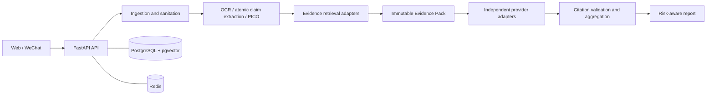

# Architecture

## Pre-pilot stabilization boundary

`pipeline/numeric_effect.py` records the source's numeric notation and can
recover a literal exposure/outcome from a simple explicit atomic relation when
model PICO grounding fails. It does not infer effect truth, change claim type,
or convert RR, fold and percentage-point measures. The new PICO JSON field is
absent from legacy serialization when null, preserving frozen hashes.

Joint checker 2.3 clarifies ranked passage `evidence_ids` versus document IDs and frozen
`source_unit_ids`. A returned child unit may normalize only to the exact parent
supplied for that statement in the same request. Both returned and resolved IDs
are audited; arbitrary or foreign IDs fail. Qualifier 1.4 records frozen-source
null/contrast reasons and permits a demonstrated frequency gradient even if the
checker called it dose; actual dose and alternative comparators remain separate.
An optional numeric warning may survive checker uncertainty only when the
qualitative finding is a literal source substring and the user claim is
qualitative. Material numbers still block through existing rules.

The development-only diagnostics read persisted artifacts for claim-stage
counts, judge categories and a failure waterfall. Live call totals use process
trace when available; a separate export reports only audited attempt counts
when that trace has expired. Neither path changes medical reports or retention.

## Reliability Slice 4.1 development contract (supersedes Slice 4 numeric format guard)

The architecture remains V2, not V3. Current sources, Pack 1.5 selection and all
three judges are unchanged. New development/test decisions use 2.3; production
retains the existing path/qualification requirements. No semantic revision loop.

`judging/compact23.py` requests 2–3 material findings, hard maximum five. Original
text, separately model-written qualitative finding, optional numeric details and
numeric dependency are retained separately. Models may still request four/five;
the preference is not represented as a guarantee of provider compliance.
`validation/numeric23.py` checks every asserted numeric field. A qualitative
warning can survive only with source-grounded independent attribution; a failed
material quantity blocks qualification and cannot become an opposite vote.
Original text is never stripped or rewritten into a fabricated proposition.

`validation/joint23.py` makes one bounded 25-second dual-target request:
source→qualitative-finding attribution and finding→exact-claim axes. The proposed
label/conclusion/other votes are absent. Source IDs, ordered statement IDs,
frozen units, provenance and numeric issues remain auditable. Transport failure
or ID/schema noncompliance fails closed without a semantic retry.

`validation/axes.py` preserves raw direction, scope, strength, role and explicit
scope/finding bases. Its pure mapping applies existing design, question, integrity,
numeric and risk rules to the judge proposal. Null comparator is unspecified;
a source-grounded same-exposure gradient may count at narrower scope for a
frequency claim. Untested dose/population, active alternative or wrong endpoint
cannot gain decisive weight by this exception. Imprecise-null/reverse-causation
findings remain nondecisive. A model's precise-null classification also requires
affirmative frozen precision/exclusion wording; that lexical necessary condition
is NOT proof of clinical equivalence. No voting, threshold or production bypass.

`validation/audit23.py` reconstructs raw content, prompt hashes, canonical JSON
snapshot, exact joint request/response and version-specific qualifier output.
JSON array/tuple representation differences do not change canonical content.
Tampering or missing raw audit still fails closed. Existing JSONB is sufficient;
append-only database behavior and historical contracts remain unchanged.

Only development diagnostics gain collapsed four-axis details. Ordinary reports
retain simple labels and the development qualification notice. See the Slice 4.1
results for semantic failures that software CI does not establish away.

## Slice 4: isolated evaluation, not a pipeline replacement

`app/evaluation` operates only through opt-in development/test commands. It
freezes read-only original artifacts or clearly labeled fresh/synthetic controls;
models reuse the same hash-bound source text without retrieving between models.
Case annotations never enter prompts. Private artifacts stay in ignored runtime,
use exclusive creation, retain original expiry and checkpoint each completed row
append-only. Budget/quota/transport failures are not medical evidence insufficiency.

V3 `app/judging/v3.py` permits only frozen document/unit IDs, controlled relation,
scope, materiality, basis and reasons. Python checks identities/content hashes/
integrity/design and derives positions with the existing question-specific policy
and assertion-numeric checks. An optional single batched decisive checker is
non-voting. There is no V3 clinical persistence/API/aggregation integration.
Evaluation-only lean/oracle subsets change selections/hashes, not source content
or role eligibility. Incompatible oracle sources remain blocked by normal policy.

`prepare_minimal_v2` is also evaluation-only; default V2 remains unchanged.
`ensemble` reuses actual V2 audit artifacts through `VerdictService(POLICY_V4)`;
V3 outputs are never invented into V2 votes. Provider response identity metadata
is captured where available, but gateway aliases are not verified pinned models.
See [bake-off gates/results](JUDGE_BAKEOFF_RESULTS.md): false decisive probe
results and lean recall loss prevented adoption. Normal evidence/medical policy,
production qualification, judge-family/count thresholds and append-only DB rules
remain as implemented in Slice 3.

## Reliability Slice 3: bounded multi-source coverage

The server-owned `app/retrieval/authoritative_manifest.json` is an approved URL
index, not a claim-to-label map. `AuthoritativeAdapter` fetches only those exact
HTTPS URLs; domain allowlist, no redirects, 12-second timeout, 2 MB response cap,
two concurrent fetches and four candidate documents bound the channel. No link
is followed, no JavaScript runs, and no judge receives browsing/search tools.
Complete visible paragraphs are entity/whitespace-normalized, sectioned, hashed
and frozen (at most eight retained paragraphs/8,000 characters per source).
Topic aliases/PICO select sources and relevant paragraphs deterministically.

PubMed and authoritative documents share a frozen envelope, distinguished by
`source_kind`. Authoritative sources have no invented PMID or DOI. Organization,
purpose, canonical URL, supplied update date, availability, fetch/review dates,
content hash, extraction version, references and currency travel with the Pack.
The source-body version hash covers the extracted body; the Pack hash also covers
the actual retained subset and its omission counts. Currency never comes from
HTTP 200, HTTP Date or a site-wide footer. Defaults are a 90-day manifest-review
window and 3,650-day document-date window: engineering freshness, not clinical currency.

New `1.5` Packs bind role-aware selections before judging. At most two direct
approved sources are reserved alongside PubMed; at most two contextual documents
use otherwise free slots. Incompatible evidence stays auditable, outside judge
input. Context cannot independently qualify a decisive conclusion. A summary
mentioning a never-smoker study is not itself a never-smoker cohort: population
exclusion heuristics for individual studies do not define the summary's scope.

`relationship_analysis` preserves actual Methods-grounded exposure assignment
separately from parent `study_design`. Unknown stays unknown. Nested observed
smoking analysis is not randomized smoking. MeSH "As Topic" is not synthesis
design. Harmful-exposure causal questions can pass the design gate with a current
direct causal assessment/systematic summary; treatment/prevention retain actual
intervention/synthesis requirements. Diagnostics require explicit accuracy/reference-
standard evidence; essential numerical magnitude checks remain unchanged. Unreviewed
convergent-observational sufficiency is deliberately not enabled.

Document purpose/design affect eligibility only: attribution → label-blind relation
classification → pure qualification still determine evidence use. One source's
sections are one source; known cited PMIDs and shared summary lineage are not
independent replications. Reports bundle multiple exact cited excerpts into one
document card. No V3 rewrite, family/count relaxation or production approval occurs.

## Implemented boundary

Reliability Slice 2 supersedes the holistic conclusion-check step for new
input/decision/validation `2.2` invocations. The existing split is not rebuilt:

```text
Frozen source units → source attribution (unchanged)
                    → one batch of statement→exact-claim relations
                    → deterministic qualification of the proposed judge label
                    → existing deterministic Lens policy / report
```

The relation request includes exact claim/type/PICO, every source-validated
eligible statement and its frozen study/integrity/scope metadata, but never the
judge's proposed label, other judges, majority or final verdict. The adapter
offers no browsing tools. Its 18-second call remains inside the existing total
validation ceiling. Strict output requires the exact ordered statement IDs.
Transport/schema/deadline failure is not scientific insufficiency.

`conclusion-qualifier-1.0` is pure Python: no calls, clock or randomness. Direct
material support/contradiction needs compatible scope, an actual relied-on
decisive finding, no opposing material direction and the existing causal design
gate. Context does not vote; an unrelated trial cannot satisfy the gate for a
cohort finding. NEI can qualify for insufficiency, unresolved semantic uncertainty,
conflict or blocked claim-strength gates, but not clear one-sided decisive evidence.
Essential numeric overclaim blocks support without relabeling the judge; accurate
counterestimates need not equal the user's claim. Incomplete integrity remains
operational uncertainty, not scientific NEI. Parent design tags never authorize
the model to invent a randomized exposure contrast.

Existing `judge_validation_run.result_json` holds typed relation provenance and
the qualifier audit. Aggregation recomputes the input/hash/frozen metadata and
pure output before accepting a validated 2.2 assessment. Append-only triggers
remain unchanged; no migration is required. Historical 2.0/2.1 decisions continue
using their recorded holistic flow and are not retrospectively requalified.
No provider selection, public route/response/UI, count threshold or production
release policy changes accompany this slice. See ADR-038 and
[Slice 2 results](RELIABILITY_SLICE2_RESULTS.md) for measurements and review limits.

Slice 1 of the reliability reset adds backend-owned citation units to the
existing frozen document input; it does not replace the schema-2.0 attribution
and conclusion architecture. New contracts are input/decision/validation 2.1,
while historical contracts are reconstructed by their recorded version.
Each whole included passage is a stable `E#.U1` unit with document/passage
hashes, content version and exact offsets. All judges receive identical units.
The backend, not the model, materializes quoted evidence. Canonical input and
Pack verification remain mandatory before semantic checking or aggregation.

Assertion-specific numeric validation distinguishes a typed wrong statistic
from an unresolved parser assignment. It checks only a statement's own unit
references (and separately the conclusion's referenced findings), not every
number in an abstract. Required unresolved quantities prevent reliance.
Optional unsupported prose needs a fresh single-budget revision with the
unchanged complete evidence, preserving rejected findings and lineage.
Semantic scope/endpoint/comparator checks remain separate and mandatory.
Existing JSONB audit columns suffice; no migration or threshold change was
made. Developer capture/evaluation utilities are read-only with respect to
historical DB records. Detailed measurements and limits are in
[RELIABILITY_SLICE1_RESULTS.md](RELIABILITY_SLICE1_RESULTS.md).

The repository implements intake, normalization, PubMed retrieval with frozen
Evidence Pack 1.3, independent judging, per-judge evidence-use validation,
deterministic verdict aggregation, and evidence-cited report construction.
Phase 7A now sequences them and adds a claim-scoped, server-gated report read
API. Phase 7B consumes that API in a framework-free web client. No live
production-qualified report exists yet.

For screenshot input, the API accepts only decoded PNG/JPEG/WebP images under
server-set byte/pixel limits, rejects animation, and stores a metadata-stripped
PNG under an opaque key. Raw image bytes remain outside PostgreSQL. At most 24
hours later, request-time and lifespan cleanup remove raw upload objects and
the associated short-lived analysis record.

## Target system


```mermaid
flowchart LR
  User[Web / WeChat] --> API[FastAPI API]
  API --> Ingest[Ingestion and sanitation]
  Ingest --> NLP[OCR / atomic claim extraction / PICO]
  NLP --> Retrieval[Evidence retrieval adapters]
  Retrieval --> Pack[Immutable Evidence Pack]
  Pack --> Judges[Independent provider adapters]
  Judges --> Validate[Citation validation and aggregation]
  Validate --> Report[Risk-aware report]
  API --- PG[(PostgreSQL + pgvector)]
  API --- Redis[(Redis)]
```

## Repository layout

```text
backend/                 FastAPI application, schema, tests, migrations
frontend/                Vanilla HTML/CSS/TypeScript + Vite application
wechat-mini-program/     Native Mini Program screen placeholders
evaluation/               Benchmark fixtures and experiment records
infrastructure/           Deployment-oriented configuration and notes
scripts/                  Developer automation
docs/                     API, data, architecture, decisions, and roadmap
```

## Service boundaries

`backend/app/adapters/` is reserved for all outbound systems: PubMed/NCBI,
WHO/CDC curated sources, Crossref, OCR, object storage, Redis-backed rate
limits, and every model provider. Endpoint code must depend on an adapter
interface, never an SDK call scattered through routes or pipeline stages.

Phase 2 adapters are concrete but replaceable: `TesseractOcrAdapter` starts a
bounded local process with no shell interpolation, `LocalFilesystemUploadStorage`
stores only sanitized images for development/container use, and
`OpenAICompatibleClaimExtractor` calls a configured structured-output endpoint.
`MiriClaimExtractor` calls the gateway documented in `../ai api.md` using
`chatgpt-auto` by default. The gateway drives browser UIs and does not promise
strict JSON schema enforcement, so the adapter parses its text response as JSON
and the backend validates every source span locally.
The extractor receives redacted text between untrusted-data delimiters. Its
candidate spans are checked locally against the exact redacted source before
persistence. When no approved extractor is configured, the API fails closed.
Source-offset checking now occurs inside the adapter's one-retry deadline so a
first invalid offset can be repaired without permitting an unbounded third
call. An explicit relation with a missing PICO slot may use that same retry;
it remains partial if still omitted. A second atomic clause may inherit only
the verbatim shared subject of an adjacent, offset-verified `, and` clause;
other PICO values stay grounded in their own raw source span.
Phase 7B.1 makes the downstream invariant explicit: each new atomic
`normalized_text` must stand alone. A deterministic validator accepts a full
clause or reconstructs only a nearby, source-verified English `and`/`but` or
simple pronoun antecedent. Inherited offsets identify the exact source
subject; `raw_text` and clause offsets are never changed. Uncertain fragments
are marked `partial` and fail normal retrieval. The same source-checked
subject may populate PICO exposure and an explicitly named population.
The current model-produced PICO slots may be null and must be treated as query
framing candidates until entity and evidence validation are implemented. The
gateway's ChatGPT model picker is best-effort, so its requested mode is logged
without claiming an exact underlying model version.

Phase 3A checks every PICO value against its own redacted atomic claim before
storing it. Phase 3B adds a local read-only index generated from official NLM
MeSH descriptor XML. The index contains preferred labels, entry terms, tree
numbers, source hash, and production year; it is installed at runtime rather
than committed. Exact preferred and entry-term matches can resolve a MeSH ID.
Ambiguity and fuzzy/low-confidence suggestions remain unassigned. UMLS is a
separate optional provider, and no CUI is invented without licensed data.
Stored entity JSONB carries the terminology provenance; no schema migration is
needed. A batch command re-normalizes untouched pending claims only, with a
dry-run default. Future retrieval must distinguish coded concepts from
unresolved suggestions and never treat terminology matches as evidence.
Audited, source-complete `partially_linked` claims now follow the lexical PubMed
path without forcing a terminology match. Missing PICO or source concepts,
unsafe scan warnings, and legacy unaudited rows still fail the orchestration
and verdict gates. Verdict qualification still requires independent approved
judges, validated citations, and all other existing safety checks.

Phase 3C restricts new claim types to a controlled taxonomy and locks explicit
English causal/association wording to its source meaning. A deterministic
quality check compares strong source MeSH phrases with grounded PICO/entity
mentions and checks type-specific required slots. Missing concepts become
`partial`, not `normalized`; the JSONB quality record explains why. Legacy
`normalized` rows become `partial` until re-audited. The extractor makes at
most one retry for malformed output or transient provider failures, without
weakening response validation or passing an invalid answer back to the model.

Phase 4A has a separate `app/retrieval/` pipeline: a deterministic QueryPlan
produces bounded MeSH, lexical, relation, and optional numeric queries; an
`app/adapters/pubmed.py` adapter uses official ESearch/EFetch; normalization
retains PubMed metadata and exact title/abstract sections; deduplication merges
  query provenance; a deterministic lexical ranker assigns relevance-only scores
  to every passage. A separate selector chooses an ordered, document-diverse
  subset for future judges (default maximum one passage per PMID), preferring
  directly relevant abstracts over title-only passages. The version 1.1 Evidence
  Pack retains all passages, their E1/E2/... identifiers, selection IDs and
  factors, and a SHA-256 over canonical content excluding retrieval timestamps.
  The database stores an append-only retrieval run, query rows, document-query
  links, versioned document content, ranked passage metadata in the pack
  snapshot, and the complete frozen JSON snapshot. Public PubMed documents may
  be reused across runs, while each
pack remains a separate audit object until the associated short-lived claim
is purged under the existing retention policy. Redis caches ESearch PMID lists for six
hours by source, query, and implementation version; failures bypass cache.
Phase 4B adds a separate integrity/enrichment layer between PubMed fetch and
Evidence Pack construction. Structured PubMed publication types and
`CommentsCorrections` links are checked first. DOI-bearing records optionally
use `app/adapters/crossref.py` for bounded REST enrichment; a versioned DOI
cache in Redis is best-effort and has a short TTL to limit staleness. At most
three DOI lookups run concurrently, with a 30-second default total enrichment
deadline; unfinished checks fail open as `unknown`. PubMed
title, abstract, and date stay primary; Crossref work type, publisher, dates,
and update relations are stored separately with field provenance. Neither
provider overwrites the other. Positive retraction signals win, while a failed
applicable check prevents an otherwise clean document from becoming `valid`.
No DOI makes Crossref not applicable; missing DOI/abstract alone is not an
upstream retrieval failure. EFetch `PubmedBookArticle` records are recognized
as present but outside the article-only normalizer, rather than mislabeled as
missing fetch records.

The deterministic classifier uses PubMed publication types, then MeSH, then
conservative title wording, and otherwise returns `unknown`. A separate
`quality_prior` summarizes coarse methodological design, human-evidence and
integrity/applicability factors; it is not a truth or support score. Topical
`retrieval_score` remains unchanged and drives selection. Retracted papers
remain in the full audit set with `retracted_excluded` but are never selected.
Evidence Pack 1.2 hashes these semantics, references, check statuses, quality
factors, and selection; wall-clock check timestamps are frozen in the snapshot
but excluded from the semantic hash. A later metadata change creates a new
pack, never an in-place edit. The pack JSONB is the authoritative integrity
snapshot; the older `evidence_document.retraction_status` field is not a
current integrity verdict. No database migration is needed for Phase 4B.

Phase 4B.1 runs deterministic relationship analysis after topical ranking and
before selection/pack hashing. `app/retrieval/directness.py` uses exact PICO
phrases and confident MeSH labels (not fuzzy candidate expansion) to locate
exposure and outcome within passages, sentences, adjacent sentences, abstract
sections, and titles. It weights RESULTS/CONCLUSIONS more than BACKGROUND;
unstructured abstracts still use concept proximity and relation cues. A
document and each passage have separate `relationship_directness` objects:
`score` in `[0,1]`, `direction` (`aligned`, `reverse`, `incidental`, `unknown`),
numeric `factors`, `reasons`, and `warnings`. A title/abstract can indicate
post-outcome management, an explicitly excluded exposure or population,
screening/cessation instead of disease risk, or a concept used only as
background/covariate. Such records remain in the full audit set. Unknown
direction stays unknown, and a contrary finding can still be direct.

The default selection priority is the exposed sum `0.30 * retrieval_score +
0.45 * passage_directness + 0.20 * document_directness + 0.05 * quality_prior`,
minus an explicit applicability penalty. Factors are stored per passage;
methodological quality cannot overwhelm relationship fit. The best passage
per document is chosen before global top-k, with relevant abstract preference,
at most one per PMID by default, and a hard exclusion of retracted records.
`retrieval_score`, `quality_prior`, integrity, document directness, and
passage directness remain distinct. Evidence Pack 1.3 hashes directness,
priority, and selection alongside prior metadata; older snapshots are not
rewritten. The existing append-only JSONB pack stores the new fields, so no
database migration is needed. This stage does **not** infer evidence support,
contradiction, causation, or a medical verdict.

Phase 7B.1 adds a separate endpoint role test after relationship directness.
Document and passage `endpoint_directness` records score, factors, reasons,
and warnings. Explicit outcome/measurement wording in title, METHODS, and
RESULTS/CONCLUSIONS outweighs BACKGROUND or mechanistic mentions. Direct
negative findings score highly too. QueryPlan 1.1 adds bounded endpoint
precision variants for measured outcomes and optional explicit population,
while keeping broad lexical/MeSH queries for recall. Selection considers
topical relevance (22%), passage/document relationship fit (28%/12%),
passage/document endpoint fit (22%/11%), and quality prior (5%), with a
bounded endpoint-focused title bonus and explicit applicability/indirect-
endpoint/relationship-reversal penalties. The sum is divided by 1.16 so the
bonus cannot saturate multiple priorities at 1.0 and erase ordering. Generic
post-disease treatment, screening, progression, or mortality endpoints are
demoted for disease-risk claims, not deleted. It is not a truth score. A
sex-only mismatch is penalized through existing applicability metadata, not
discarded. If at least three quantitative-endpoint documents score at least
0.5, selected evidence omits documents below 0.35 endpoint directness; those
documents remain frozen and auditable. Pack 1.4
freezes these factors and selected IDs. Pack 1.3 retains its original hash
serialization and remains auditable; version compatibility changes no
judge, citation, verdict, or report decision rule.

Phase 5A adds `app/judging/` after the frozen pack, without changing retrieval.
It first validates Evidence Pack 1.3's semantic hash, claim identity, unique
selection, selected flags, document presence, and retraction exclusion. One
versioned system instruction plus one canonical JSON data prompt is built from
the claim snapshot and only selected E passages. Evidence text, titles, and
metadata stay in the untrusted data message. No provider tool is supplied.
`JudgeProvider` is a small outbound interface; the HTTPX OpenAI-shaped/Miri
adapter is one implementation. Explicit slots name provider, model, and actual
model family. Duplicate families fail configuration except for a deliberate
development/test override. Miri requested modes are best-effort; production
must verify underlying model identity and native browsing controls.
Search-mode names also fail configuration by default and in every staging or
production run. A separate `JUDGE_ALLOW_SEARCH_ENABLED_DEVELOPMENT` flag can
permit development/test plumbing calls only. The service rechecks this boundary
even for caller-constructed slots, and each affected run persists override,
bypass, and unverified-isolation flags. The versioned prompt explicitly forbids
browsing and search; no browsing tool is passed to the adapter. This is not a
guarantee that a browser-backed provider suppresses its own search behavior.

Judges run concurrently with a configurable semaphore, 45-second per-attempt
and 80-second per-slot total defaults, one retry, independent failure records,
and a process-local per-slot circuit breaker. The strict `JudgeDecision` has
only three evidence labels; it rejects unsupported labels, unknown or duplicate
E citations, and absent fields. The `judge_run` table stores one append-only
success or failure per invocation, keyed to the stored pack ID/hash and exact
prompt hash. The canonical validated decision is retained; failed raw model
text, secrets, and prompts are not logged. A PostgreSQL trigger forbids updates
to judge rows. Rows follow claim/pack retention
through foreign-key cascades. Agreement statistics are descriptive only. The
legacy `model_evaluation` and `final_verdict` tables remain unused by Phase 5A.

Phase 6A adds `app/validation/` after each successful judge run. It rehashes
the exact Pack 1.3 and each cited passage, checks selected E IDs and frozen
document provenance/integrity, then compares explicit numbers, PICO scope,
and relationship strength. Deterministic fatal defects cannot be overridden
by semantic entailment. Cited and opposing passages have separate records.
The optional `EvidenceEntailmentValidator` receives only one exact passage,
the atomic claim, judge label/short reasoning, and frozen metadata. Its
versioned system prompt treats source text as untrusted, forbids browsing and
outside knowledge, and requires a strict single-E-ID response. No live
provider is configured; offline fakes are acceptance fixtures.

Numeric alignment compares only typed comparable quantities: percent changes
and percentage points, RR/OR/HR, CI/p values, sample counts, safe mass/volume
doses, and same-unit durations. Unsupported or ambiguous conversions remain
`uncertain`; absent quantitative assertions are `not_applicable`. A material
mismatch is fatal for `supported` use or a judge-reasoning numeric assertion.
A contradiction may correctly cite a differing claim number. Scope checks
use stated PICO slots and frozen study metadata; explicit adult/child,
human/animal, prevention/treatment, comparator, outcome, and post-outcome
mismatches can be fatal to a decisive judge use. Missing scope is not invented.
For causal claims, association-only observational evidence is
`weaker_than_claim` and cannot validate a decisive causal label; the same
limitation can support a properly framed inconclusive judgment. These lexical
rules are conservative, not medical entailment.

Controlled fatal issue codes cover pack/citation identity, missing provenance,
retraction, material numeric/scope/relation mismatch, and evidence that
contradicts its claimed judge use. Unknown integrity, partial scope, uncertain
numeric/relation/entailment, low quality prior, and provider unavailability are
warnings. `validated` requires eligible citations and successful one-passage
entailment; material uncertainty in numbers, scope, or integrity yields
`partially_validated` even if the semantic provider says the use is entailed.
The provider's concise evidence claim, scope assessment, and reason are kept
in the citation audit record. Without an approved provider, the CLI reports
`unable_to_validate` unless a deterministic fatal issue makes it `invalid`.
`judge_validation_run` inserts a new row on every execution with versions,
prompt hash when applicable, timing, result JSON, and failure category. A
PostgreSQL update trigger protects this append-only audit; normal retention
cascades follow the underlying judge/pack. Phase 6A has no public endpoint,
final aggregation, medical verdict, or report. The legacy `final_verdict`
table remains unused.

Phase 6B adds a pure `app/verdict/` policy engine. `AggregationInput` names the
claim, Pack ID/hash, every judge and validation run ID, mode, and policy
version; no latest-row selection is permitted. The engine rehashes Pack 1.3,
checks claim normalization, retrieval status, selected evidence, and audit
identity before assessing any labels. Successful `no_results` produces
`not_enough_evidence`; retrieval/pack/normalization failure produces
`unable_to_verify_reliably`. One failed/invalid/partial/unavailable validation
never becomes a decisive vote or a vote for the opposite label.
In `fixture_or_evaluation` mode only, an inconclusive assessment with a
partial-scope warning may qualify when every cited use is semantically
validated, the only material limitation is that partial scope, and all frozen
provenance/integrity checks pass. It still cannot make a decisive claim.

`verdict-policy-1.1` requires two distinct, fully validated judges and no
validated opposite label for standard-risk supported/contradicted. High risk
requires three unanimous fully validated judges. Mixed validated decisive
labels, all inconclusive labels, or insufficiently decisive validated evidence
yield `not_enough_evidence`. Fewer qualified judges than the risk-specific
minimum is operational inability, not evidence insufficiency. This is a
decision table after qualification and evidence-use validation, not raw
majority voting. No numeric truth probability is calculated.

Current live V2 orchestration uses versioned `verdict-policy-1.3`. In
development/evaluation only, one *fully validated decisive* standard-risk
assessment can produce a visibly provisional Supported/Contradicted report.
This does not change the production two-judge threshold, the high-risk
three-judge threshold, the frozen citation gates, or historical policy 1.1/1.2
results. No-evidence and invalid-assessment runs cannot use this shortcut.

Production additionally requires audited underlying model identity/snapshot,
actual family verification, search isolation without any bypass, and a
policy-approved entailment provider. New identity/family audit booleans on
`judge_run` default false; current judge service never asserts them. No live
entailment provider is approved in policy 1.0. Thus the development Miri
smoke fails production qualification, while offline evaluation results carry
`production_qualified=false`. Each execution inserts a distinct, update-
protected `verdict_run` with explicit input IDs, policy/engine versions,
controlled reason codes, deterministic result JSON and semantic hash. The
legacy one-row `final_verdict` remains unused. Phase 6B does not itself
generate human-readable report text.

Phase 6C adds a pure `app/report/` builder downstream of the immutable
`verdict_run`. It loads one explicit VerdictRun ID and only the Pack, JudgeRun,
and JudgeValidationRun IDs recorded in that run. The persisted verdict label
and semantic hash are rechecked, not recomputed. The frozen Pack 1.3 hash is
rechecked before any excerpt is shown. Controlled versioned templates map all
reason codes to concise prose and preserve the four existing labels; no LLM,
outside source, truth-confidence score, or new medical interpretation is used.

Evidence cards are sourced only from selected Pack passages actually cited by
qualified, validated assessments; evaluation-only partial-scope inconclusive
uses can produce cards marked `relevant_but_insufficient`. Cards retain exact E ID, source
identifiers, document metadata, citation roles, validation-run IDs, and a
deterministic 600-character prefix of the frozen passage; full passages stay
in the Pack audit. Source excerpts are structurally distinct from Lens prose.
Retracted or unverified positive citations are never cards. An operational
`unable_to_verify_reliably` report shows reasons and no evidence cards; a
successful no-results `not_enough_evidence` report says only that the
configured search returned none, not that no research exists. Material
numeric, causal-strength, scope, and integrity validation flags become
controlled limitations. Excluded assessments and descriptive validated-label
counts remain visible without model-brand ranking or confidence percentages.

Every report has a separate health-information safety notice and a mandatory
development/evaluation notice when `production_qualified=false`. Report
provenance contains the explicit audit IDs, verdict and Pack hashes, versions,
and generation time. The report semantic hash covers all stable content and
excludes only generation time; each execution inserts a new append-only
`report_run` row with an UPDATE-blocking PostgreSQL trigger. Reports follow
the VerdictRun's claim-retention cascade. The Phase 6C CLI creates a report
from one explicit VerdictRun; Phase 7A can also create one during an analysis.

## Phase 7A orchestration boundary

`analysis_run` is a mutable orchestration record, not a medical artifact. It
stores an opaque ID, hashed Idempotency-Key and canonical request digest,
queued/running/completed/failed/partially_completed state, current stage,
completed stages, per-stage timestamps, short retention deadline, counts,
and a safe failure code. `claim_analysis_run` stores claim-scoped state and
the explicit Pack ID/hash, JudgeRun IDs, JudgeValidationRun IDs, VerdictRun
ID, and ReportRun ID. Only these checkpoints are mutable; frozen Evidence
Packs and later audit rows remain insert-only. The analysis UUID is also the
eventual Submission UUID, preserving the existing API link.

The HTTP start request reserves the run and returns 202. A FastAPI background
task uses a fresh database session and the existing Phase 2 ingestion service,
then iterates atomic claims independently:

```text
extracting (existing OCR / redaction / claim extraction / normalization)
  -> for each claim: normalization eligibility -> PubMed retrieval
  -> frozen Pack -> configured judges -> per-success validation
  -> verdict-policy-1.1 -> deterministic LensReport
```

The orchestrator contains sequencing and timeouts, not medical logic. A
non-`normalized` claim stops before retrieval; no Pack or report is invented.
Successful empty retrieval produces a frozen empty Pack and follows Not
Enough Evidence policy. Judge/provider/validation qualification failures can
produce an audited Unable to Verify Reliably report. Unrecoverable retrieval,
pack, or persistence failure leaves that claim failed with no fabricated
downstream artifact; peers may complete and the parent becomes
`partially_completed`.

A repeated identical Idempotency-Key returns the same run and never schedules
another worker; no-key requests intentionally create new runs. No automatic
stage retry or startup replay exists. On startup in the current **single API
worker** deployment, queued/running rows are marked `worker_interrupted`;
their checkpointed artifact IDs remain available. A crash in the narrow gap
between an immutable artifact insert and its checkpoint may leave an orphaned
immutable run. It is not guessed via latest-row lookup or automatically
replayed; explicit operator recovery/transactional checkpointing belongs to
a later queue-backed design. Raw text remains only in task memory during
processing, not persisted for crash replay.

`GET /v1/analyses/{id}` is the polling source of truth. The existing events
route emits one SSE-format progress snapshot, not a long-lived event bus.
`GET .../claims` exposes per-claim artifact IDs; the report route loads only
its checkpointed ReportRun, verifies semantic hash, Pack/claim/verdict IDs,
qualification, and explicit audit IDs, and never retrieves new sources.
Staging/production return 403 for an unqualified report; development/test
inspection returns the frozen LensReport with its mandatory evaluation marker.
URL input still returns 501; screenshot input uses the sanitized upload/OCR/
PII path. Analysis responses carry no-store and no-referrer headers, but
anonymous UUID access is not authentication and needs review before release.

Configurable ceilings are 180 seconds per retrieval, 300 seconds per claim,
and 900 seconds per analysis, alongside existing extractor/judge limits. This
in-process runner is deliberately small for the competition MVP. It does not
offer multi-worker coordination, durable queue delivery, automatic model-call
replay, or a public resume endpoint.

PostgreSQL is the system of record. Redis is transient cache/rate-limit state
and must not be the sole copy of evidence or an analysis result. Evidence
passage vectors use pgvector, avoiding a separate vector database in the MVP.

## Phase 7B web boundary

The web app uses vanilla HTML/CSS/TypeScript with Vite. React and Tailwind
were intentionally removed: the old frontend was only an extraction shell,
and a small page-level state model is sufficient for the competition MVP.
`src/api/` is the sole fetch boundary; `src/types/` mirrors the Phase 7A
status, claim, and LensReport contracts; `src/pages/` owns home/analysis page
state; `src/components/` builds safe DOM fragments; `src/utils/` owns routing,
polling, and idempotency; `src/styles/` holds design tokens and responsive CSS.

`/` holds the text/screenshot submission. `/analysis/{uuid}` can be loaded
directly or refreshed; the server's SPA fallback serves `index.html` for the
deep link. The analysis page polls `GET /v1/analyses/{id}` and `/claims` about
every 1.5 seconds, serially, with bounded network backoff and abort on page
cleanup. Terminal states stop polling. Reports are fetched only for completed
claim checkpoints and never recomputed in the browser. The one-shot SSE route
is not used as a live stream. A retry of an uncertain POST reuses its
Idempotency-Key; a deliberate input change creates a new key. A same-tab
session record can retain only a SHA-256 digest, opaque key, and upload ID,
not medical text or image bytes.

Each report displays backend-provided reasons, exact frozen source excerpts,
limitations, safety text, and a prominent backend development notice when
`production_qualified=false`. The frontend does not infer source roles or a
medical verdict. It maps four controlled verdict labels and safe operational
error categories to UI copy. A 403 report gate is not a fifth medical result.
The claim card displays the backend's source-verified standalone proposition,
not a raw second-clause fragment missing its shared subject; exact source
offsets and raw wording remain in the API for provenance.
Text nodes are created with `textContent`, and external source URLs are used
only when the backend-provided URL is HTTP(S). No credentials enter the web
bundle. URL submission, WeChat, localization, and public access controls
remain later work.

## Safety and trust boundary

### Evidence-to-judgment contract, superseding the Phase 6A free-text check

The historical Phase 6A description below documents schema 1.0 behavior;
for new runs ADR-033 supersedes its whole `reasoning_summary`-versus-each-
citation check. `judge-input-2.0` is a deterministic, content-hashed view of
the immutable Pack: diverse selected documents retain available frozen title,
methods, results, and conclusion sections within a bounded character budget.
Each passage keeps its original E ID and SHA-256, and omitted sections are
recorded. All judges receive the same view. Validators may only inspect this
view, never silently expand it; Pack 1.3/1.4 hashes remain unchanged.

Schema 2.0 judge statements cite exact passage quotes, jointly where needed.
`judge-validation-2.0` checks frozen provenance, quotation, and statement-
local typed numbers; a semantic validator then assesses attribution and
scope of each statement. A separate semantic check asks whether *validated*
findings justify the proposed label for the original claim. A source opposing
the claim may support a judge's accurate description of that opposition.
For coordinated fragments, `exact_atomic_claim` is the authoritative
standalone proposition, while `raw_source_span` and `pico.original_claim`
remain provenance. Retrieval selection excludes unasserted active-comparator
studies from the judge subset but retains them in the Evidence Pack; a
no-exposure or expressly claimed comparator remains eligible. New judge and
semantic prompts require the actual source comparison and measured mechanism
to match a proposed decisive conclusion. A specific gain/growth endpoint
cannot be satisfied by generic muscle soreness/biomarker measurements. A
mixed-sex trial does not establish applicability when the numbered arm
testing the claimed exposure is explicitly limited to the other sex; the
arm-restriction signal and exclusion remain auditable in the pack. A
conjunction is not mediation.
Uncertain scope or missing context is not a proven mismatch. Valid findings
remain recorded even if a conclusion fails, but only a fully validated
conclusion can become an eligible decisive assessment.

One target-specific revision may create a linked child `judge_run` with the
same input and one model attempt. The active child or original is explicitly
checkpointed, not found by latest-row search; a parent and child cannot both
vote. The new policy version keeps the same count, risk, and production gates.
Unqualified reports remain blocked in staging/production. Development Unable
reports can show neutral exact retrieved excerpts when Pack provenance passes.

Raw user content and retrieved documents are untrusted. Future stages must
separate them from prompts/instructions, validate uploads and URLs, redact PII
before model calls, check retractions and identifiers in retrieval, and force
high-risk cases through stricter abstention thresholds.

## Slice 4 development path (2026-10-02)

Normal development/test workers retain the 2.2 attribution/conclusion contract,
Pack 1.5 and Slice 3 selection. Three independent configured judge slots receive
the identical frozen snapshot. Compact qualitative findings omit optional stats;
source-unit IDs and backend-materialized quotations are unchanged. Numeric prose
is rejected at the response boundary on qualitative requests, with at most the
existing format retry. Quantitative requests retain essential numeric checks.

For each parsed judge: deterministic reference/provenance/assertion preflight,
ONE joint semantic request containing distinct source-attribution and exact-claim
relation arrays, then the existing pure question-specific qualifier. The checker
receives no proposed label/conclusion/other judge and cannot vote. It receives
the same frozen visible units to detect omitted contrary findings. Slot 3 is the
development checker (currently Gemini Lite); its own judge vote remains separate.
Attribution failure, missing counterevidence, uncertainty or tampering cannot
produce a qualified decision. The exact joint request, hash, response and qualifier
remain in append-only JSONB; no migration or historical rewrite is needed.

Versioned joint prompts 1.0/1.1 remain reconstructible. Version 1.1 distinguishes
direction from scope and preserves negation. Aggregation accepts one *HTTP*
request only for this audited dual-target development contract, not one missing
semantic target. Production still requires the existing qualifications/counts.
Development semantic revisions are disabled; production/historical cascade paths
remain unchanged. V3 plus generic consistency guards is evaluation-only because
its real-source basis/schema gate failed. No lean selector was adopted.

The opt-in `docker-compose.slice4-budget.yml` wraps server and evaluation model
traffic with the same atomic SQLite ceiling. It is a task guard, not medical
policy or a permanent billing limiter. Its ledger is exhausted at 120 requests;
do not reset it or silently switch ledgers. Software tests must not run app startup
reconciliation against an active acceptance database; the health test mocks those
lifecycle side effects, and the documented PostgreSQL command uses a separate DB.
