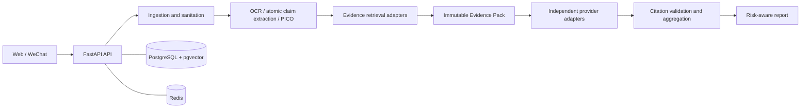

# Architecture

## Implemented boundary

The repository implements intake, normalization, PubMed retrieval with frozen
Evidence Pack 1.3, independent Phase 5A judging, and Phase 6A per-judge
evidence-use validation. It makes no final medical judgment.

For screenshot input, the API accepts only decoded PNG/JPEG/WebP images under
server-set byte/pixel limits, rejects animation, and stores a metadata-stripped
PNG under an opaque key. Raw image bytes remain outside PostgreSQL. At most 24
hours later, request-time and lifespan cleanup remove raw upload objects and
the associated short-lived analysis record.

## Target system


```mermaid
flowchart LR
  User[Web / WeChat] --> API[FastAPI API]
  API --> Ingest[Ingestion and sanitation]
  Ingest --> NLP[OCR / atomic claim extraction / PICO]
  NLP --> Retrieval[Evidence retrieval adapters]
  Retrieval --> Pack[Immutable Evidence Pack]
  Pack --> Judges[Independent provider adapters]
  Judges --> Validate[Citation validation and aggregation]
  Validate --> Report[Risk-aware report]
  API --- PG[(PostgreSQL + pgvector)]
  API --- Redis[(Redis)]
```

## Repository layout

```text
backend/                 FastAPI application, schema, tests, migrations
frontend/                React + TypeScript + Vite + Tailwind application
wechat-mini-program/     Native Mini Program screen placeholders
evaluation/               Benchmark fixtures and experiment records
infrastructure/           Deployment-oriented configuration and notes
scripts/                  Developer automation
docs/                     API, data, architecture, decisions, and roadmap
```

## Service boundaries

`backend/app/adapters/` is reserved for all outbound systems: PubMed/NCBI,
WHO/CDC curated sources, Crossref, OCR, object storage, Redis-backed rate
limits, and every model provider. Endpoint code must depend on an adapter
interface, never an SDK call scattered through routes or pipeline stages.

Phase 2 adapters are concrete but replaceable: `TesseractOcrAdapter` starts a
bounded local process with no shell interpolation, `LocalFilesystemUploadStorage`
stores only sanitized images for development/container use, and
`OpenAICompatibleClaimExtractor` calls a configured structured-output endpoint.
`MiriClaimExtractor` calls the gateway documented in `../ai api.md` using
`chatgpt-auto` by default. The gateway drives browser UIs and does not promise
strict JSON schema enforcement, so the adapter parses its text response as JSON
and the backend validates every source span locally.
The extractor receives redacted text between untrusted-data delimiters. Its
candidate spans are checked locally against the exact redacted source before
persistence. When no approved extractor is configured, the API fails closed.
The current model-produced PICO slots may be null and must be treated as query
framing candidates until entity and evidence validation are implemented. The
gateway's ChatGPT model picker is best-effort, so its requested mode is logged
without claiming an exact underlying model version.

Phase 3A checks every PICO value against its own redacted atomic claim before
storing it. Phase 3B adds a local read-only index generated from official NLM
MeSH descriptor XML. The index contains preferred labels, entry terms, tree
numbers, source hash, and production year; it is installed at runtime rather
than committed. Exact preferred and entry-term matches can resolve a MeSH ID.
Ambiguity and fuzzy/low-confidence suggestions remain unassigned. UMLS is a
separate optional provider, and no CUI is invented without licensed data.
Stored entity JSONB carries the terminology provenance; no schema migration is
needed. A batch command re-normalizes untouched pending claims only, with a
dry-run default. Future retrieval must distinguish coded concepts from
unresolved suggestions and never treat terminology matches as evidence.

Phase 3C restricts new claim types to a controlled taxonomy and locks explicit
English causal/association wording to its source meaning. A deterministic
quality check compares strong source MeSH phrases with grounded PICO/entity
mentions and checks type-specific required slots. Missing concepts become
`partial`, not `normalized`; the JSONB quality record explains why. Legacy
`normalized` rows become `partial` until re-audited. The extractor makes at
most one retry for malformed output or transient provider failures, without
weakening response validation or passing an invalid answer back to the model.

Phase 4A has a separate `app/retrieval/` pipeline: a deterministic QueryPlan
produces bounded MeSH, lexical, relation, and optional numeric queries; an
`app/adapters/pubmed.py` adapter uses official ESearch/EFetch; normalization
retains PubMed metadata and exact title/abstract sections; deduplication merges
  query provenance; a deterministic lexical ranker assigns relevance-only scores
  to every passage. A separate selector chooses an ordered, document-diverse
  subset for future judges (default maximum one passage per PMID), preferring
  directly relevant abstracts over title-only passages. The version 1.1 Evidence
  Pack retains all passages, their E1/E2/... identifiers, selection IDs and
  factors, and a SHA-256 over canonical content excluding retrieval timestamps.
  The database stores an append-only retrieval run, query rows, document-query
  links, versioned document content, ranked passage metadata in the pack
  snapshot, and the complete frozen JSON snapshot. Public PubMed documents may
  be reused across runs, while each
pack remains a separate audit object until the associated short-lived claim
is purged under the existing retention policy. Redis caches ESearch PMID lists for six
hours by source, query, and implementation version; failures bypass cache.
Phase 4B adds a separate integrity/enrichment layer between PubMed fetch and
Evidence Pack construction. Structured PubMed publication types and
`CommentsCorrections` links are checked first. DOI-bearing records optionally
use `app/adapters/crossref.py` for bounded REST enrichment; a versioned DOI
cache in Redis is best-effort and has a short TTL to limit staleness. At most
three DOI lookups run concurrently, with a 30-second default total enrichment
deadline; unfinished checks fail open as `unknown`. PubMed
title, abstract, and date stay primary; Crossref work type, publisher, dates,
and update relations are stored separately with field provenance. Neither
provider overwrites the other. Positive retraction signals win, while a failed
applicable check prevents an otherwise clean document from becoming `valid`.
No DOI makes Crossref not applicable; missing DOI/abstract alone is not an
upstream retrieval failure. EFetch `PubmedBookArticle` records are recognized
as present but outside the article-only normalizer, rather than mislabeled as
missing fetch records.

The deterministic classifier uses PubMed publication types, then MeSH, then
conservative title wording, and otherwise returns `unknown`. A separate
`quality_prior` summarizes coarse methodological design, human-evidence and
integrity/applicability factors; it is not a truth or support score. Topical
`retrieval_score` remains unchanged and drives selection. Retracted papers
remain in the full audit set with `retracted_excluded` but are never selected.
Evidence Pack 1.2 hashes these semantics, references, check statuses, quality
factors, and selection; wall-clock check timestamps are frozen in the snapshot
but excluded from the semantic hash. A later metadata change creates a new
pack, never an in-place edit. The pack JSONB is the authoritative integrity
snapshot; the older `evidence_document.retraction_status` field is not a
current integrity verdict. No database migration is needed for Phase 4B.

Phase 4B.1 runs deterministic relationship analysis after topical ranking and
before selection/pack hashing. `app/retrieval/directness.py` uses exact PICO
phrases and confident MeSH labels (not fuzzy candidate expansion) to locate
exposure and outcome within passages, sentences, adjacent sentences, abstract
sections, and titles. It weights RESULTS/CONCLUSIONS more than BACKGROUND;
unstructured abstracts still use concept proximity and relation cues. A
document and each passage have separate `relationship_directness` objects:
`score` in `[0,1]`, `direction` (`aligned`, `reverse`, `incidental`, `unknown`),
numeric `factors`, `reasons`, and `warnings`. A title/abstract can indicate
post-outcome management, an explicitly excluded exposure or population,
screening/cessation instead of disease risk, or a concept used only as
background/covariate. Such records remain in the full audit set. Unknown
direction stays unknown, and a contrary finding can still be direct.

The default selection priority is the exposed sum `0.30 * retrieval_score +
0.45 * passage_directness + 0.20 * document_directness + 0.05 * quality_prior`,
minus an explicit applicability penalty. Factors are stored per passage;
methodological quality cannot overwhelm relationship fit. The best passage
per document is chosen before global top-k, with relevant abstract preference,
at most one per PMID by default, and a hard exclusion of retracted records.
`retrieval_score`, `quality_prior`, integrity, document directness, and
passage directness remain distinct. Evidence Pack 1.3 hashes directness,
priority, and selection alongside prior metadata; older snapshots are not
rewritten. The existing append-only JSONB pack stores the new fields, so no
database migration is needed. This stage does **not** infer evidence support,
contradiction, causation, or a medical verdict.

Phase 5A adds `app/judging/` after the frozen pack, without changing retrieval.
It first validates Evidence Pack 1.3's semantic hash, claim identity, unique
selection, selected flags, document presence, and retraction exclusion. One
versioned system instruction plus one canonical JSON data prompt is built from
the claim snapshot and only selected E passages. Evidence text, titles, and
metadata stay in the untrusted data message. No provider tool is supplied.
`JudgeProvider` is a small outbound interface; the HTTPX OpenAI-shaped/Miri
adapter is one implementation. Explicit slots name provider, model, and actual
model family. Duplicate families fail configuration except for a deliberate
development/test override. Miri requested modes are best-effort; production
must verify underlying model identity and native browsing controls.
Search-mode names also fail configuration by default and in every staging or
production run. A separate `JUDGE_ALLOW_SEARCH_ENABLED_DEVELOPMENT` flag can
permit development/test plumbing calls only. The service rechecks this boundary
even for caller-constructed slots, and each affected run persists override,
bypass, and unverified-isolation flags. The versioned prompt explicitly forbids
browsing and search; no browsing tool is passed to the adapter. This is not a
guarantee that a browser-backed provider suppresses its own search behavior.

Judges run concurrently with a configurable semaphore, 45-second per-attempt
and 80-second per-slot total defaults, one retry, independent failure records,
and a process-local per-slot circuit breaker. The strict `JudgeDecision` has
only three evidence labels; it rejects unsupported labels, unknown or duplicate
E citations, and absent fields. The `judge_run` table stores one append-only
success or failure per invocation, keyed to the stored pack ID/hash and exact
prompt hash. The canonical validated decision is retained; failed raw model
text, secrets, and prompts are not logged. A PostgreSQL trigger forbids updates
to judge rows. Rows follow claim/pack retention
through foreign-key cascades. Agreement statistics are descriptive only. The
legacy `model_evaluation` and `final_verdict` tables remain unused by Phase 5A.

Phase 6A adds `app/validation/` after each successful judge run. It rehashes
the exact Pack 1.3 and each cited passage, checks selected E IDs and frozen
document provenance/integrity, then compares explicit numbers, PICO scope,
and relationship strength. Deterministic fatal defects cannot be overridden
by semantic entailment. Cited and opposing passages have separate records.
The optional `EvidenceEntailmentValidator` receives only one exact passage,
the atomic claim, judge label/short reasoning, and frozen metadata. Its
versioned system prompt treats source text as untrusted, forbids browsing and
outside knowledge, and requires a strict single-E-ID response. No live
provider is configured; offline fakes are acceptance fixtures.

Numeric alignment compares only typed comparable quantities: percent changes
and percentage points, RR/OR/HR, CI/p values, sample counts, safe mass/volume
doses, and same-unit durations. Unsupported or ambiguous conversions remain
`uncertain`; absent quantitative assertions are `not_applicable`. A material
mismatch is fatal for `supported` use or a judge-reasoning numeric assertion.
A contradiction may correctly cite a differing claim number. Scope checks
use stated PICO slots and frozen study metadata; explicit adult/child,
human/animal, prevention/treatment, comparator, outcome, and post-outcome
mismatches can be fatal to a decisive judge use. Missing scope is not invented.
For causal claims, association-only observational evidence is
`weaker_than_claim` and cannot validate a decisive causal label; the same
limitation can support a properly framed inconclusive judgment. These lexical
rules are conservative, not medical entailment.

Controlled fatal issue codes cover pack/citation identity, missing provenance,
retraction, material numeric/scope/relation mismatch, and evidence that
contradicts its claimed judge use. Unknown integrity, partial scope, uncertain
numeric/relation/entailment, low quality prior, and provider unavailability are
warnings. `validated` requires eligible citations and successful one-passage
entailment; material uncertainty in numbers, scope, or integrity yields
`partially_validated` even if the semantic provider says the use is entailed.
The provider's concise evidence claim, scope assessment, and reason are kept
in the citation audit record. Without an approved provider, the CLI reports
`unable_to_validate` unless a deterministic fatal issue makes it `invalid`.
`judge_validation_run` inserts a new row on every execution with versions,
prompt hash when applicable, timing, result JSON, and failure category. A
PostgreSQL update trigger protects this append-only audit; normal retention
cascades follow the underlying judge/pack. Phase 6A has no public endpoint,
final aggregation, medical verdict, or report. The legacy `final_verdict`
table remains unused.

PostgreSQL is the system of record. Redis is transient cache/rate-limit state
and must not be the sole copy of evidence or an analysis result. Evidence
passage vectors use pgvector, avoiding a separate vector database in the MVP.

## Safety and trust boundary

Raw user content and retrieved documents are untrusted. Future stages must
separate them from prompts/instructions, validate uploads and URLs, redact PII
before model calls, check retractions and identifiers in retrieval, and force
high-risk cases through stricter abstention thresholds.
